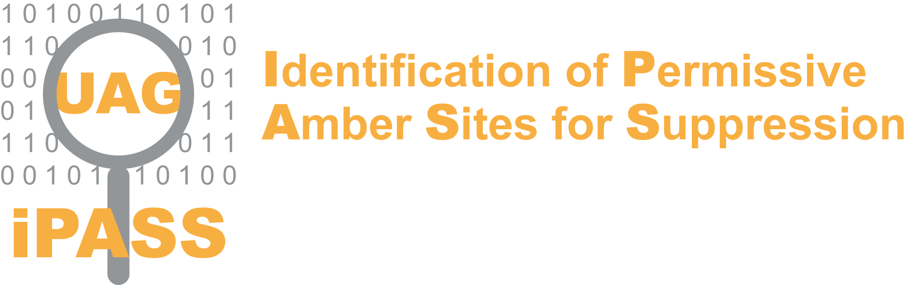

# iPASS: Identification of Permissive Amber Sites for Suppression

iPASS is a Shiny web application designed to analyze and optimize sequences for efficient non-canonical amino acid (ncAA) incorporation in mammalian cells. 

## Features

- **File Upload**: Upload a FASTA file containing the sequence to be analyzed.
- **Sequence Input**: Input DNA sequences directly into the app.
- **Optimize Context**: Optimize iPASS scores by modifying codons around amber stop codons.
- **Interactive Visualization**: View and interact with plots of iPASS scores.
- **Detailed Output**: Displays scores, sequences, and optimized sequences.

## Installation

### Prerequisites

- [R](https://www.r-project.org/)
- [RStudio](https://www.rstudio.com/)
- Required R packages: `shiny`, `seqinr`, `tidyverse`, `cowplot`, `DT`, `Biostrings`, `gtools`, `fst`, `data.table`

### Running the App

1. Clone this repository.
2. Ensure all the necessary R packages are installed.
3. Open the project in RStudio.
4. Run the `app.R` file using `runApp()`.

## Usage

1. **Upload a Sequence**:
   - Use the *File Upload* or *Sequence Input* section to provide your DNA sequence.
   - Only DNA characters (G, A, T, C) are allowed.

2. **Optimize Context**:
   - Check *Optimize context* to enhance ncAA incorporation efficiency.

3. **View Results**:
   - The app displays an iPASS score which predicts ncAA incorporation efficiency.
   - Use the interactive plot to zoom in and explore scores.
  
4. **User Guide and Feedback**:
   - The side panel contains instructions, output interpretations, and contact information for feedback.

## Citation

Please cite the iPASS tool as described in the publication: 
Bartoschek MD, Ugur E, Nguyen TA, Rodschinka G, Wierer M, Lang K, Bultmann S. Identification of permissive amber suppression sites for efficient non-canonical amino acid incorporation in mammalian cells. Nucleic Acids Res. 2021 Jun 21;49(11):e62. doi: 10.1093/nar/gkab132. PMID: 33684219; PMCID: PMC8216290.
## Feedback

For bug reports or feedback, email s.bultmann(at)posteo.de. Your insights are valuable to improving iPASS.
